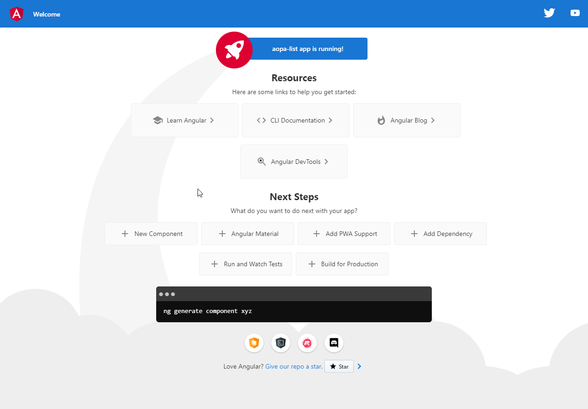
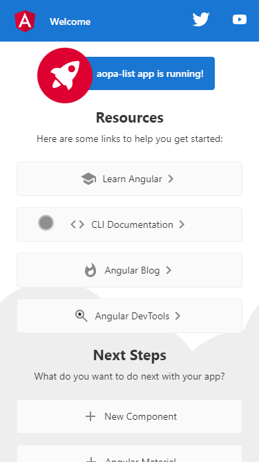

<div align="right">

[](https://app.netlify.com/sites/aopa-list/deploys)

</div>

<p align="center">
  
</p>

<p align="center"> 
  
     
     
       
</p>

<p align="center">
 <a href="#eye_speech_bubble-visualizar">Visualizar</a> •
 <a href="#information_source-sobre">Sobre</a> •
 <a href="#arrow_forward-executar">Executar</a> •
 <a href="#hammer_and_wrench-tecnologias">Tecnologias</a> • 
 <a href="#brain-conceitos-aplicados">Conceitos</a> •
 <a href="#sparkles-funcionalidades">Funcionalidades</a> •
 <a href="#boy-autores">Autores</a> •
 <a href="#balance_scale-licença">Licença</a>
</p>

---

## :eye_speech_bubble: **Visualizar**

<div align="center">

Deploy do front-end efetuado no [Netlify](https://www.netlify.com/) para visualizar: [Clique Aqui](https://aopa-list.netlify.app/)

|                             :computer:Desktop                             |                             :iphone: Mobile                              |
| :-----------------------------------------------------------------------: | :----------------------------------------------------------------------: |
| <kbd></kbd> | <kbd></kbd> |

</div>
  
---

## :information_source: Sobre

<div align="center">

Aplicação feita para aplicar os conceitos ensinados no grupo de estudos de Angular.

---

</div>

## :arrow_forward: **Executar**

<div align="center">

Para executar esse projeto você precisa baixar este repositório, ter o Gerenciador de Pacotes do Node ([`NPM`](https://www.npmjs.com/get-npm)) ou o Gerenciador de Pacotes YARN ([`YARN`](https://yarnpkg.com/getting-started)) instalado.

🌐 FrontEnd

Abra o prompt de comando no diretório do projeto na pasta angular-todo-list/front-end, e execute os seguintes códigos:

<details>
  <summary><i>com <b>npm</b></i></summary>
  
  ```bash
  # Instalar dependências
  $ npm install ou npm i

# Iniciar o servidor de desenvolvimento

$ ng serve --open ou ng s -o

````

</details>

<details>
<summary><i>com <b>yarn</b></i></summary>

```bash
# Instalar dependências
$ yarn install

# Iniciar o servidor de desenvolvimento
$ ng serve --open ou ng s -o

````

</details>

> ⚠️ O servidor de desenvolvimento será iniciado na porta: 4200 - Acesse <http://localhost:4200>

</div>

---

## :hammer_and_wrench: **Tecnologias**

<div align="center">

|           :globe_with_meridians: FrontEnd           |
| :-------------------------------------------------: |
|          [Angular 13](https://angular.io/)          |
| [Angular Material 13](https://material.angular.io/) |
|           [SASS](https://sass-lang.com/)            |
| [TypeScript 4.0.2](https://www.typescriptlang.org/) |

</div>

---

## :brain: **Conceitos Aplicados**

<div align="center">

|       :page_facing_up:        |
| :---------------------------: |
| ............................. |
| ............................. |
| ............................. |
| ............................. |

</div>

---

## :sparkles: **Funcionalidades**

<div align="center">

|       :page_facing_up:        |
| :---------------------------: |
| ............................. |
| ............................. |
| ............................. |
| ............................. |
| ............................. |
| ............................. |
| ............................. |

</div>

---

## :boy: **Autores**

<div align="center">

Desenvolvido com ❤️ por

<table>
  <tr>
    <td align="center">
      <a href="https://PORTFOLIOURL.COM">
        <br />
        <sub><b>Gleison Almeida</b></sub>
      </a>
      <br/>
      <a href="https://www.linkedin.com/in/gleison-ribeiro-a65257119" title="LinkedIn"></a>
      <a href="https://github.com/gleisonkz" title="GitHub"></a>
      <a href="https://www.facebook.com/gleisonKZ" title="Facebook"></a>
    </td>
    <td align="center">
      <a href="https://PORTFOLIOURL.COM">
        <br />
        <sub><b>Cristhian Santos</b></sub>
      </a>
      <br/>
      <a href="https://www.linkedin.com/in/CONTRIBUTORNAME" title="LinkedIn"></a>
      <a href="https://github.com/CristhianFSantos" title="GitHub"></a>
      <a href="https://www.facebook.com/CONTRIBUTORNAME" title="Facebook"></a>      
    </td>
    <td align="center">
      <a href="https://github.com/Joaovitorsw">
        <br />
        <sub><b>João Vitor Pereira </b></sub>
      </a>
      <br/>
      <a href="https://www.linkedin.com/in/joao-vitor-pereira-dos-santos/" title="LinkedIn"></a>
      <a href="https://github.com/Joaovitorsw" title="GitHub"></a>
    </td>
  </tr>
  <tr>
    <td align="center">
      <a href="https://PORTFOLIOURL.COM">
        <br />
        <sub><b>Jorge Vitor</b></sub>
      </a>
      <br/>
      <a href="https://www.linkedin.com/in/CONTRIBUTORNAME" title="LinkedIn"></a>
      <a href="https://github.com/CONTRIBUTORNAME" title="GitHub"></a>
      <a href="https://www.facebook.com/CONTRIBUTORNAME" title="Facebook"></a>
    </td>
    <td align="center">
      <a href="https://PORTFOLIOURL.COM">
        <br />        
      </a>
      <br/>
      <a href="https://www.linkedin.com/in/CONTRIBUTORNAME" title="LinkedIn"></a>
      <a href="https://github.com/CONTRIBUTORNAME" title="GitHub"></a>
      <a href="https://www.facebook.com/CONTRIBUTORNAME" title="Facebook"></a>
    </td>
    <td align="center">
      <a href="https://PORTFOLIOURL.COM">
        <br />
        <sub><b>Ryan Drop</b></sub>
      </a>
      <br/>
      <a href="https://www.linkedin.com/in/CONTRIBUTORNAME" title="LinkedIn"></a>
      <a href="https://github.com/CONTRIBUTORNAME" title="GitHub"></a>
      <a href="https://www.facebook.com/CONTRIBUTORNAME" title="Facebook"></a>
    </td>
  </tr>
</table>

</div>

---

## :balance_scale: **Licença**

<div align="center">

Copyright © 2021 .<br />
This project is licensed by [MIT](./LICENSE).

</div>
